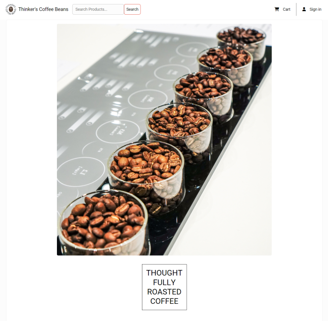
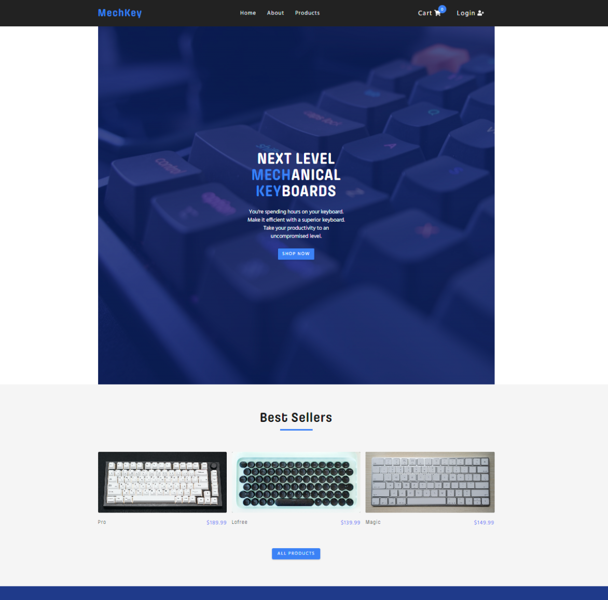

  
  
  
  

Software Engineer in NYC motivated by creative business products and solutions  with a background in business-management and philosophy-logic. Check out <a href="https://www.changtime247.com">my website</a> for more info!

<h1 align="center">Projects</h1>
<table bordercolor="#37b5ff">
  <tr>
    <td width="33%" valign="top" align='center'>
      <h3 align="center">Thinker's Coffee Beans</h3>
         
        
         
        

    
  
      

        
<strong>Node.js Express React Redux MongoDB</strong>  Fullstack ecommerce store for coffee beans. 

    </td>
    <td width="33%" valign="top" align='center'>
      <h3 align="center">MechKey</h3>
       
        
       
        

  
  
      

        
<strong>React Redux Styled-components</strong> Frontend ecommerce store for mechanical keyboards.

    </td>
    <td width="33%" valign="top" align='center'>
      <h3 align="center">Spell a 'Moji</h3>
         
      
         
        

        
        
      

        
<strong>React Bootstrap</strong> Over 400 emojis/ words to learn to spell for students.

    </td>
  </tr>
  <tr>
      <td width="33%" valign="top" align='center'>
      <h3 align="center">peekAFlick</h3>
       
        
       
        

  
  
      

        
<strong>React CSS</strong> Search any movie by title and preview the movie.

    </td>
    <td width="33%" valign="top" align='center'>
      <h3 align="center">HackerNews</h3>
         
        
         
        

          
        
        

        
<strong>React CSS</strong>  Search for HackerNews tech articles.

    </td>
    <td width="33%" valign="top" align='center'>
      <h3 align="center">Westminster Shorter Catechism</h3>
         
      
         
        

          
  
  
      

        
<strong>Vite-React Node.js Express Tailwindcss</strong> App to learn the historic tenets of Christianity.

    </td>

  </tr>
</table>

<h1 align="center">Technologies</h1>

    
    
    
    
    
    
    
    
    
    
    

