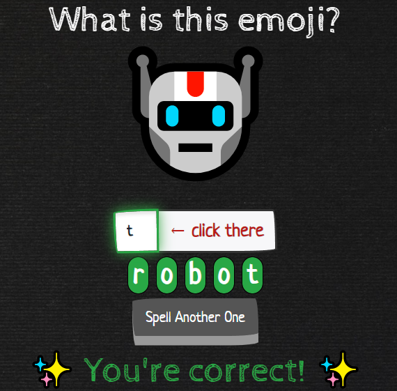
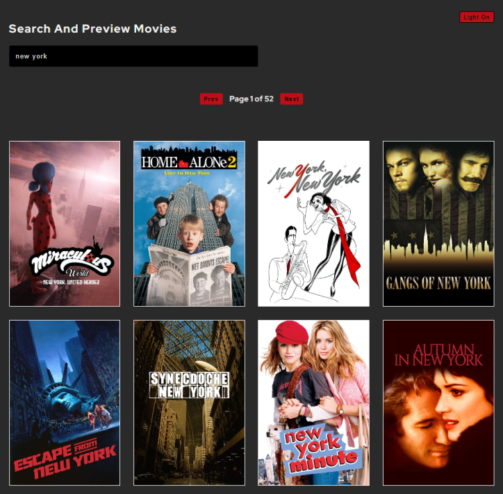
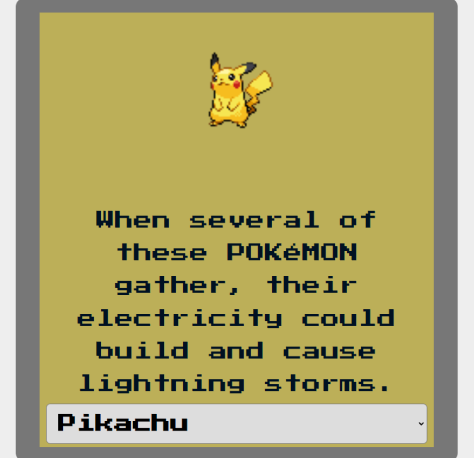
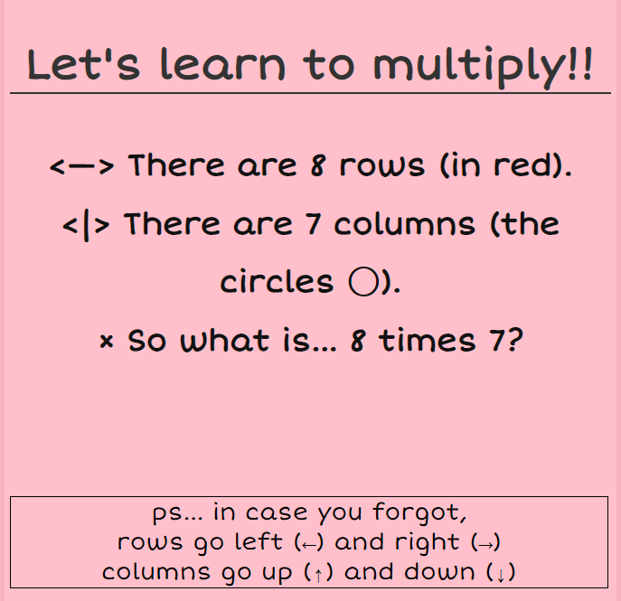

  
  
  
  
  

Software Engineer in NYC motivated by creative business products and solutions  with a background in business-management and philosophy/ logic. Check out <a href="https://www.changtime247.com">my website</a> for more info!

<h1 align="center">Projects</h1>
<table bordercolor="#37b5ff">
  
  <tr>
    <td width="33%" valign="top" align='center'>
      <h3 align="center">Thinker's Coffee Beans</h3>
         
        
         
        

          
    
  
      

        
<strong>Node.js Express React Redux MongoDB</strong>  Ecommerce store for coffee beans. Coffee for thought, and consumption too.

    </td>
    <td width="33%" valign="top" align='center'>
      <h3 align="center">Spell a 'Moji</h3>
         
      
         
        

          
  
  
      

        
<strong>React Bootstrap</strong> Over 400 emojis/ words to learn to spell. Good for early learners and new-to-English speakers.

    </td>
    <td width="33%" valign="top" align='center'>
      <h3 align="center">peekAFlick</h3>
       
        
       
        

  
  
      

        
<strong>React CSS</strong> Search any movie by title. Preview the movie.

    </td>

  </tr>
  <tr>
    <td width="33%" valign="top" align='center'>
      <h3 align="center">OG Pokedex</h3>
         
        
         
        

          
    
  
      

        
<strong>React CSS</strong>  A digital catalog of various pokemon species. Gotta catch 'em all - at least the OG ones.

    </td>
    <td width="33%" valign="top" align='center'>
      <h3 align="center">Multipiu</h3>
         
      
         
        

          
  
  
      

        
<strong>JQuery</strong> Visual learning tool to teach simple multiplication using the concept of rows and columns.

    </td>
    <td width="33%" valign="top" align='center'>
      <h3 align="center">Changtime247</h3>
       
        
       
        

  
  
      

        
<strong>HTML, CSS, JavaScript</strong> www.changtime247.com - my personal site

    </td>

  </tr>
</table>

<h1 align="center">Technologies</h1>

    
    
    
    
    
    
    
    
    
    
    

